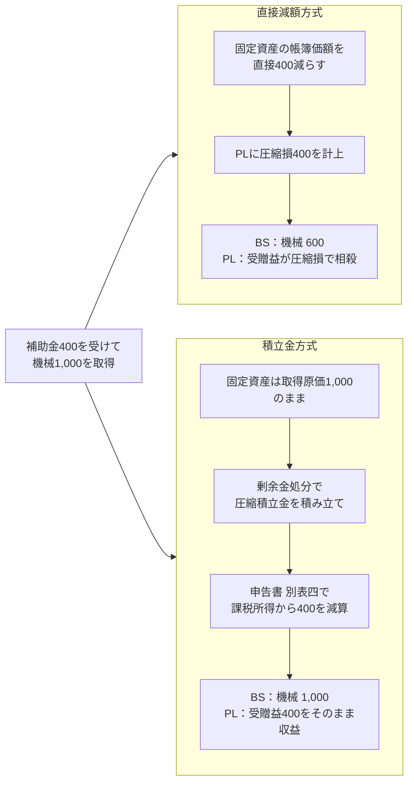
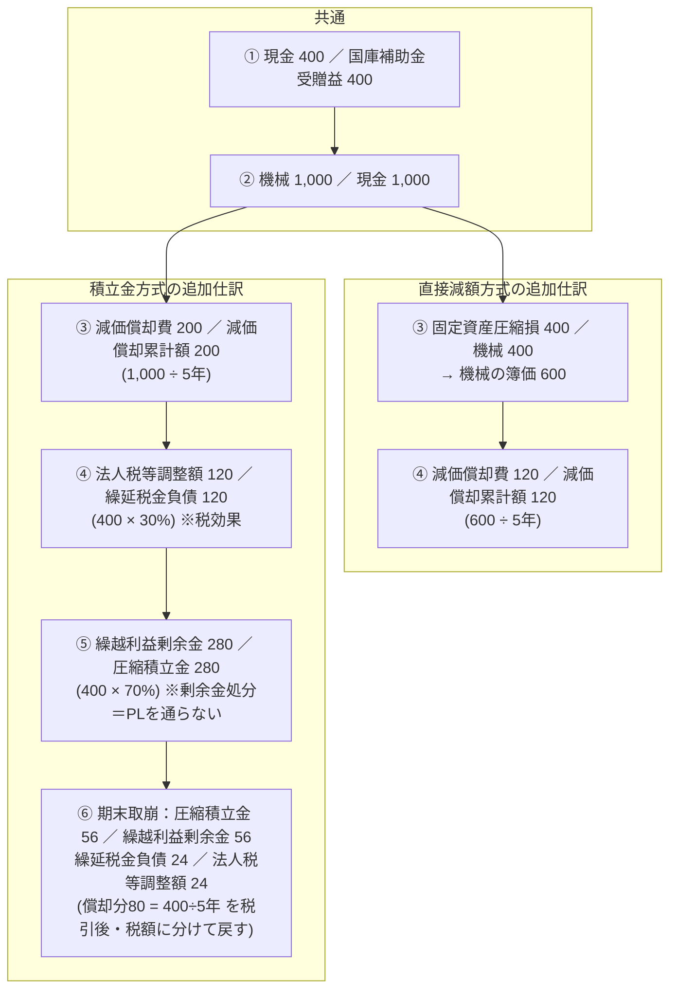
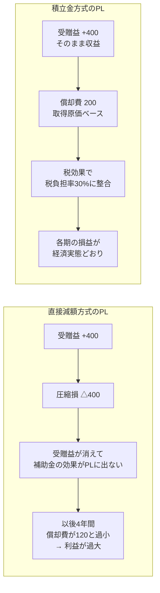
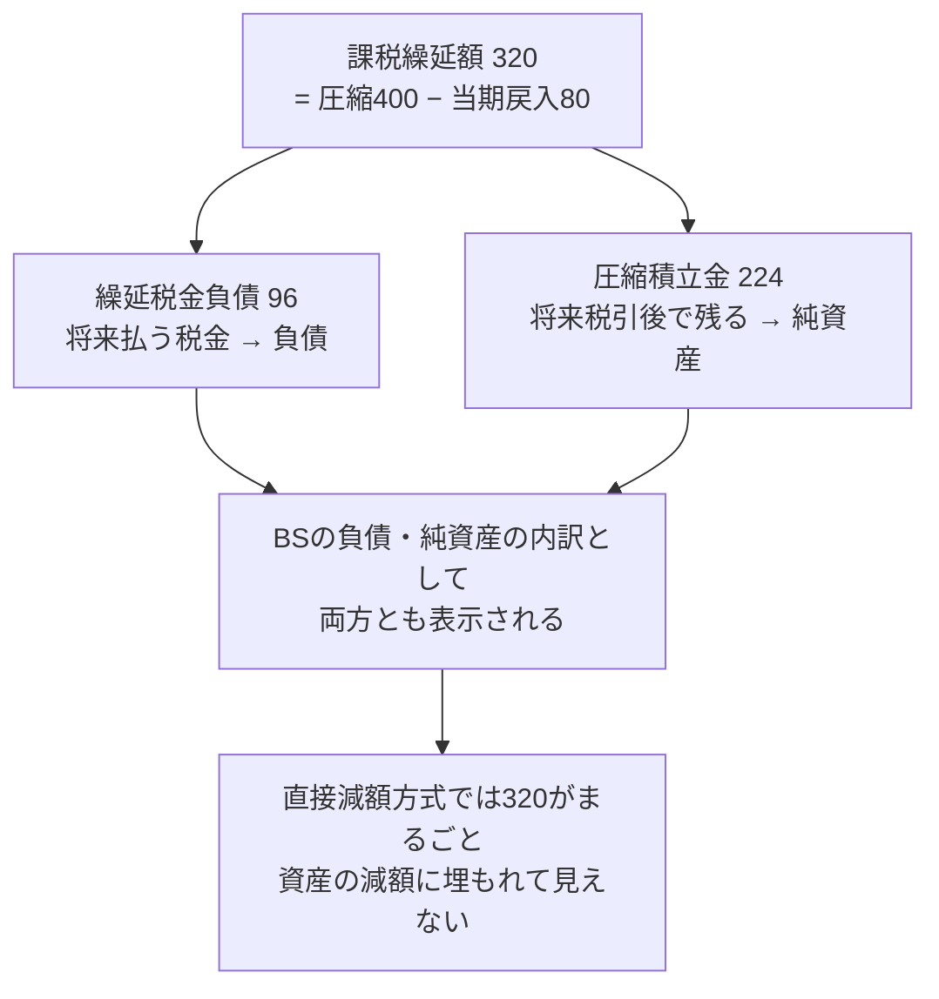
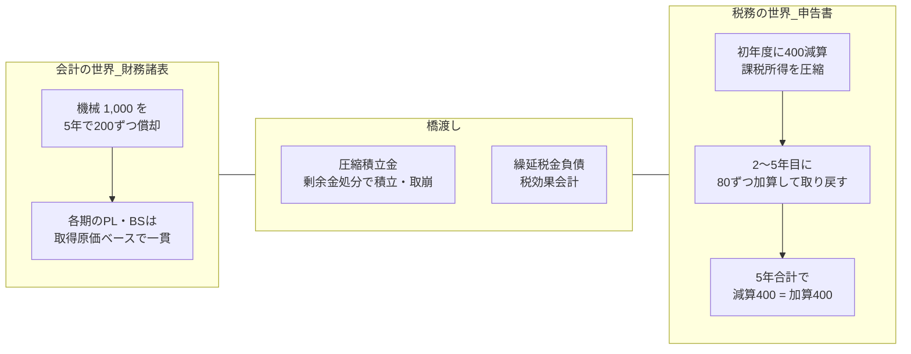
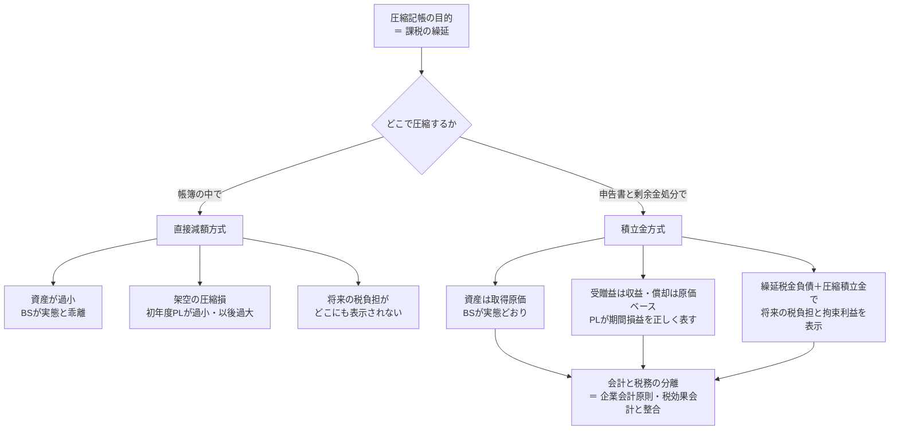

# 積立金方式が会計上BS・PLを正しく表す理由（図解）

圧縮記帳には「直接減額方式」と「積立金方式」の2つがある。
どちらも**税務上の効果（課税の繰延）は同じ**だが、会計上の財務諸表への影響がまったく違う。
本資料は、なぜ積立金方式のほうが会計上BS（貸借対照表）・PL（損益計算書）を正しく表すのかを、数値例と図で整理する。

---

## 0. 数値例の前提

| 項目 | 金額・条件 |
|---|---|
| 国庫補助金の受領 | 400 |
| 機械の取得原価 | 1,000 |
| 圧縮限度額 | 400（補助金相当額） |
| 減価償却 | 定額法・耐用年数5年・残存価額0 |
| 法定実効税率 | 30% |
| その他の営業利益（毎期） | 1,000 |

---

## 1. 全体像：2つの方式は「どこで」圧縮するかが違う



**ポイント**

- 直接減額方式は「会計帳簿の中」で圧縮する → 財務諸表が歪む。
- 積立金方式は「純資産の内訳の振替」と「税務申告書」で圧縮する → 財務諸表は実態のまま。

---

## 2. 仕訳の流れ（初年度）



積立金方式の仕訳のうち、**PLに影響するのは③減価償却費と④⑥の税効果だけ**。
圧縮そのもの（⑤の積立）は「繰越利益剰余金 → 圧縮積立金」という純資産内部の振替であり、費用・収益にならない。

---

## 3. PLの比較：積立金方式は「期間損益」を歪めない

### 初年度のPL

| 項目 | 直接減額方式 | 積立金方式 | 経済実態 |
|---|---:|---:|---|
| 営業利益 | 1,000 | 1,000 | |
| 国庫補助金受贈益 | 400 | 400 | 補助金400を受け取った |
| 固定資産圧縮損 | △400 | ― | **実際には損失は発生していない** |
| 減価償却費 | △120 | △200 | 1,000の機械を5年で使う → 1年あたり200 |
| **税引前当期純利益** | **880** | **1,200** | 補助金分の儲けを正しく表すのは右 |
| 法人税等（申告納税額） | △264 | △264 | 課税所得880 × 30%（両方式で同額） |
| 法人税等調整額 | ― | △96 | 繰延税金負債 (400−80)×30% |
| **税金合計** | **264** | **360** | |
| **当期純利益** | **616** | **840** | |
| 税負担率 | 30.0% | 30.0% | 積立金方式は税引前1,200 × 30% = 360 で整合 |



**なぜ正しいと言えるか**

1. 補助金を受けたという事実は「収益」であり、資産を減らす「損失」は発生していない。直接減額方式の圧縮損は**税務目的で作られた架空の損失**にすぎない。
2. 減価償却費は「実際に投下した1,000」を基礎にすべき。直接減額方式では初年度に利益を圧縮した反動で、2年目以降は償却費が過小になり利益が過大に出る（利益の期間帰属が歪む）。
3. 積立金方式では、税効果会計を通じて「税引前利益 × 実効税率 = 税金費用」の関係が保たれ、PL上の税負担が実態と整合する。

---

## 4. BSの比較：積立金方式は「資産」も「純資産」も実態どおり

### 初年度末のBS（機械と関連科目のみ抜粋）

```
【直接減額方式】                        【積立金方式】
┌──────────────┬──────────────┐        ┌──────────────┬──────────────┐
│ 機械  480    │              │        │ 機械  800    │ 繰延税金負債  │
│ (1,000       │              │        │ (1,000       │        96    │
│  −圧縮400    │  利益剰余金  │        │  −償却200)   ├──────────────┤
│  −償却120)   │   ※過小     │        │              │ 圧縮積立金   │
│              │              │        │              │       224    │
│              │              │        │              ├──────────────┤
│              │              │        │              │ 繰越利益剰余金│
└──────────────┴──────────────┘        └──────────────┴──────────────┘
  ▲ 実際に持っている資産より320少ない     ▲ 320 = 繰延税金負債96 + 圧縮積立金224
```

| BS項目 | 直接減額方式 | 積立金方式 | 意味 |
|---|---:|---:|---|
| 機械（簿価） | 480 | 800 | 投下資本1,000のうち未償却分。実態は800 |
| 繰延税金負債 | ― | 96 | 将来、償却超過が加算されて払う税金（320×30%） |
| 圧縮積立金 | ― | 224 | 課税繰延のうち税引後で会社に残る部分（320×70%） |
| 差額 | | 320 | 直接減額方式では**BSから消えている** |



**なぜ正しいと言えるか**

1. **資産の評価**：機械は1,000で買った。取得原価主義に従えば簿価は1,000−償却が正しい。直接減額方式の480は、資産の実態でも時価でもない「税務上の便宜的な数字」。
2. **負債の認識**：課税の繰延は「将来払う税金」を生む。積立金方式では繰延税金負債として負債に計上され、将来のキャッシュアウトが見える。
3. **純資産の内訳**：圧縮積立金は「配当できない（縛りのある）利益剰余金」であることを内訳で明示する。直接減額方式では利益剰余金自体が過小になり、自己資本比率など財務指標も歪む。

---

## 5. 5年間の推移：積立金方式は「会計」と「税務」が別々に、しかし整合して動く

| 年度 | 減価償却費（会計） | 税務上の償却限度 | 別表四調整 | 圧縮積立金（期末） | 繰延税金負債（期末） |
|---|---:|---:|---|---:|---:|
| 1年目 | 200 | 120 | 減算400 ／ 加算80 | 224 | 96 |
| 2年目 | 200 | 120 | 加算80 | 168 | 72 |
| 3年目 | 200 | 120 | 加算80 | 112 | 48 |
| 4年目 | 200 | 120 | 加算80 | 56 | 24 |
| 5年目 | 200 | 120 | 加算80 | 0 | 0 |
| **合計** | **1,000** | **600** | **減算400 ／ 加算400** | | |



**この分離が本質**

- 圧縮記帳は「課税を繰り延べる」税務上の制度であって、資産価値や損益の実態を変える経済事象ではない。
- 積立金方式は、税務の要請を **申告調整（別表四・別表五(一)）と剰余金処分** で処理し、財務諸表本体には持ち込まない。
- そのため、会計上のBS・PLは「1,000で買った機械を5年で使い、補助金400を受け取った会社」という実態をそのまま表す。

---

## 6. まとめ：一枚図



| 観点 | 積立金方式が正しい理由 |
|---|---|
| BS（資産） | 取得原価主義に従い、実際に投下した金額から償却した簿価を表示する |
| BS（負債） | 課税繰延による将来の税金支払を繰延税金負債として認識する |
| BS（純資産） | 圧縮積立金として「拘束された利益」を内訳表示し、利益剰余金が過小にならない |
| PL（収益） | 補助金受贈益を圧縮損で消さず、受け取った事実を収益として表す |
| PL（費用） | 減価償却費が取得原価ベースになり、各期の期間損益が歪まない |
| PL（税金） | 税効果会計により、税引前利益と税金費用が実効税率で整合する |
| 制度上の位置づけ | 税務上の措置を申告調整で処理し、財務諸表を税務目的で歪めない（会計と税務の分離） |

---

## 補足：実務上の留意点

- 積立金方式は税効果会計の適用が前提。税効果を適用しない場合は、圧縮積立金を400全額で積み立てることになる（中小企業などで見られる）。
- 圧縮積立金の積立・取崩は株主総会決議（または取締役会決議）による剰余金処分だが、決算日後の処分でも申告調整により当期の損金算入が認められる。
- 税務上の減価償却限度額は圧縮後の600を基礎に計算されるため、会計上の償却費200との差額80が毎期「償却超過額」として別表四で加算される。この加算が「取り戻し」の実体である。
